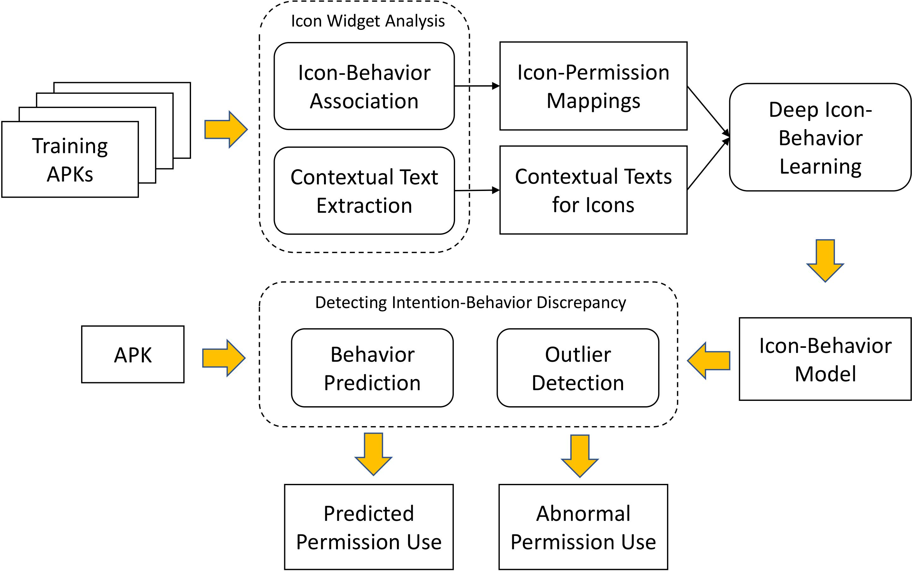

# DeepIntent

Implementation of the paper *DeepIntent: Deep Icon-Behavior Learning for Detecting Intention-Behavior Discrepancy in Mobile Apps*.

This is a collaborative work with: 

<figure>
    
    
</figure>

## Introduction

In this work, we focus on detecting the intention-behavior discrepancies of interactive UI widgets in Android apps, which express their intentions via texts or images and respond to users’ interactions (e.g., clicking a button). Specifically, we focus on the interactive UI widgets that use icons to indicate their expected behaviors, referred to as icon widgets, since icon widgets are prevalent in apps and many of them access sensitive information.

We propose to build a novel framework, DeepIntent, that learns an icon-behavior model from a large number of apps, and uses the model to detect undesired behaviors. The design of DeepIntent is based on three key insights. 

> First, mobile apps’ UIs are expected to be evident to users, and icons indicating the same type of sensitive behavior should have similar looks. 

> Second, in different UI contexts, icons may reflect different intentions. 

> Third, users expect certain behaviors when interacting with icon widgets that have specific looks, and undesired behaviors usually contradict users’ expectations.

To capture such general expectation, we propose to develop program analysis techniques that can associate icons to their sensitive behaviors, and apply the techniques to extract the associations from a corpus of popular apps to learn models on expected behaviors for icon widgets with specific looks. Such model can then be used to detect abnormal behaviors as intention-behavior discrepancies. In particular, we use permission uses to summarize icon widgets’ sensitive behaviors (i.e., sensitive APIs invoked), since undesired behaviors need to request permissions to access sensitive information.

Based on these key insights, DeepIntent provides a novel learning approach, deep icon-behavior learning, which consists of three major phases (Icon Widget Analysis, Learning Icon-Behavior Model, and Detecting Intention-Behavior Discrepancies)



We collect a set of 9,891 benign apps and 16,262 malicious apps, from which we extract over 10,000 icon widgets that are mapped to sensitive permission uses. We use 80% of the icons from the benign apps as training data, and detect the intention-behavior discrepancies on the remaining icons from the benign apps and all the icons from malicious apps. For the test set, we manually label whether there is an intention-behavior discrepancy to form the ground truth. Finally, DeepIntent returns a ranked list based on the outlier scores for detecting intention-behavior discrepancies.

## Requirements

+ Android SDK Version: 18
+ PScout Version: jellybean
+ JAVA Version: 1.8.0_181
+ Python Version: 3.6.0
+ Python Library:
	+ numpy >= 1.16.0
	+ Keras >= 2.2.4
	+ pyod >= 0.7.4
	+ Pillow >= 5.4.1 (PIL)
	+ opencv-python >= 3.4.3 (cv2)
	+ nltk >= 3.4.0
	+ pytesseract >= 0.2.6
	+ autocorrect >= 0.4.4
	+ sklearn >= 0.21.1
	+ translate >= 3.4.0 (optional, to translate any other language to English through Internet)
	+ matplotlib >= 3.0.2 (optional, to plot precision and recall curve)

## Repository Contents

1. The program analysis is in `DeepIntent/IconWidgetAnalysis/Static_Analysis/` directory. It contains icon-widget-association analysis (i.e. GATOR, IconIntent), icon-behavior-association analysis (i.e. ic3, APKCallGraph), and icon-permisssion mapping. 

2. Icon Behavior Learning is in `DeepIntent/IconBehaviorLearning/` directory. It leverages the co-attention mechanism to jointly model icons and texts, and trains an icon-behavior model that predicts the permission uses of icon widgets. 

3. Intention Behavior Discrepancy is in `DeepIntent/IntentionBehaviorDiscrepancy` directory. It try to make use of the robust learned low-dimensional features to learn outlier model and integrate prediction results to detect intention behavior discrepancy.

## Usage

DeepIntent contains three major components. 

1. The first step is to run static analysis on Android apps, obtain the association results of UI widgets and icons from .xml files, their handlers and API calls in the source code, and corresponding permission uses. Detailed instruction is shown in [IconWidgetAnalysis](IconWidgetAnalysis).

We provided several example APKs, including both benign apps and malicious apps, through BaiduYun([link](https://pan.baidu.com/s/1E0iE-Nm8xx4qsFB6PnkYwA), password: nmqf). These APKs are contained in BaiduYun's `example` folder, the structure and usage of this folder could be further refer to [example APKs overview](data/example).

2. The second step is to train the deep learning model. It contains model construction, training and testing, and predicting with new data. Detailed instruction is shown in [Icon Behavior Learning](IconBehaviorLearning).
We also provided data preparing codes, such as [contextual text extraction](IconWidgetAnalysis/ContextualTextExtraction) or [pre-process](IconBehaviorLearning/pre_process.py), for completeness.

For data, we provided pre-processed data and trained model through BaiduYun. These data could be directly execute by the current codes. The data structure could be see at [Total data set](data/total), and how to run could also refer to [Icon Behavior Learning phase](IconBehaviorLearning).

3. The third step is to detect intention behavior discrepancies. It loads the trained deep learning model to get rubust low-dimensional features and obtain its actual permission uses by static analysis. Then, use them to learn group-wise outlier detectors. Finally, it aggregates the group-based outlier scores to form the the final outlier score.

To evaluate intention behavior discrepancies, we manually labeled 1274 icons from benign apps, and 1362 icons from malicious apps. These data are also provided through BaiduYun. The data structure could be see at [Total data set](data/total), and how to run could also refer to [Intention Behavior Discrepancies phase](IntentionBehaviorDiscrepancy). 

## Citing

If you find DeepIntent useful in your research, we require you to cite the following paper:

```
@inproceedings{
	title = {DeepIntent: Deep Icon-Behavior Learning for Detecting Intention-Behavior Discrepancy in Mobile Apps},
	author = {Shengqu Xi, Shao Yang, Xusheng Xiao, Yuan Yao, Yayuan Xiong, Fengyuan Xu, Haoyu Wang, Peng Gao, Zhuotao Liu, Feng Xu, Jian Lu},
	booktitle = {2019 ACM SIGSAC Conference on Computer and Communications Security (CCS'19), November 11--15, 2019, London, United Kingdom},
	year = {2019},
}
```
